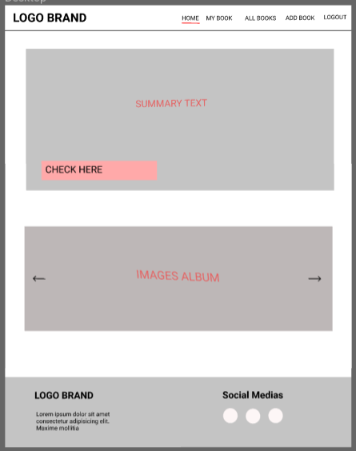
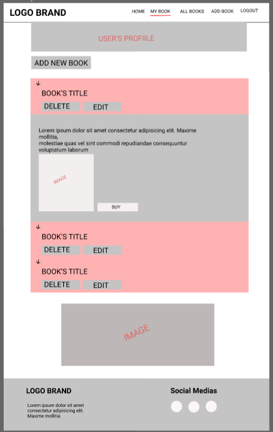

#  Milestone Project 3
## Love Books

[Visit my live website here!](https://milestone3-rodrigopalazon.herokuapp.com/)

# Table Of Contents

1. [Overview](#overview)
<!-- 2. [UX](#ux)
    - [Target Audience](#target-audience)
    - [User Stories](#user-stories)
3. [Design](#design)
    - [Wireframes](#wireframes)
    - [Typography](#typography)
    - [Colours](#colours)
    - [Database](#database)
4. [Features](#features)
    - [Current Features](#current-features)
    - [Future Features](#future-features)
5. [Technologies Used](#technologies-used)
    - [Languages](#languages)
    - [Database](#database)
    - [Frameworks Libraries and Programmes](#frameworks-libraries-and-programmes)
6. [Testing](#testing)
7. [Deployment](#deployment)
8. [Credits](#credits) -->

# Overview

Love Books is a site that is designed for people who are looking to keep a record of books that they have read, and share their reviews with others. 
Users are able to view books and reviews without needing to create an account. This allows new users to preview the site before registering so they have an idea of what the site is like. 
Some of our main categories are Philosophy, Technology, Fiction, Science, Programming, and much more, for people that are always interested in learning something new. Share with other users your favorites books, and check some recommendations as well.

[Back to contents](#table-of-contents)

# UX

## Target Audience

The target audience for my site is people who are avid readers. They’ll be able to keep a list of the books they have rated and reviewed, as well as view other people’s reviews.
It's also allows users Create, Read, Update and Delete, their new posts whenever they want. 

## User Stories

### First Time and Returning Users

All users of this site will be looking for similar things, outlined below:
-	Easy and clear navigation throughout the entire site on all device types.
-	To be able to view/preview the site before registering an account.
-	Have clear Registration/Log In pages.
-	Have the ability to add their own reviews and keep a record of them.
-	To be able to edit and delete reviews posted.
-	Search the site to find other reviews.
-	For the review information to be clear and concise.
-   Keep a record of books they are interested in.
-	Find links where they can purchase the books.
-	To be provided with contact information and social links.
-	Once finished, to securely log out of the site.

### Site Owner/Admin

-	For users to have easy access to all areas of the site.
-	For the site to be clear and concise.
-	The ability for users to contact them for any feedback/issues surrounding the site.
-	To be able to add, edit and delete book reviews.
-	Have access to an admin account whereby the owner/admin can add affiliate links to each review left by a user, and earn money from those links. (For project purposes, these links will NOT be affiliate links, and will only be links to the books on Amazon.)

[Back to contents](#table-of-contents)

# Design

## Wireframes

To create the wireframes, I used Figma. I started with the mobile wireframes and worked my way to a larger screen size. Below are the links to the completed wireframes;

-   [Mobile](static/images/wf_mobile.png)
<!-- -	[Desktop/Laptop](static/images/wf_desktop.png) -->
<!-- -     -->

-	[Desktop/Laptop](

  
   

)

### Bugs
#### Heroku deploy issue:
https://stackoverflow.com/questions/68435865/could-not-find-a-version-that-satisfies-requirements-aptural-0-5-2-in-heroku

