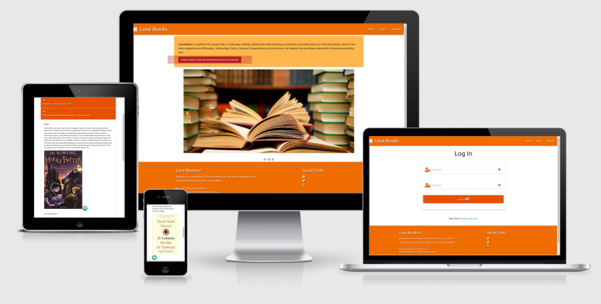

#  Milestone Project 3
## Love Books

[Visit my live website here!](https://milestone3-rodrigopalazon.herokuapp.com/)

# Table Of Contents

1. [Overview](#overview)
2. [UX](#ux)
    - [Target Audience](#target-audience)
    - [User Stories](#user-stories)
3. [Design](#design)
    - [Wireframes](#wireframes)
    - [Typography](#typography)
    - [Colours](#colours)
    - [Database](#database)
4. [Features](#features)
    - [Current Features](#current-features)
    - [Future Features](#future-features)
5. [Technologies Used](#technologies-used)
    - [Languages](#languages)
    - [Database](#database)
    - [Frameworks Libraries and Programmes](#frameworks-libraries-and-programmes)
6. [Testing](#testing)
7. [Deployment](#deployment)
8. [Credits](#credits)

# Overview

Love Books is a site that is designed for people who are looking to keep a record of books that they have read, and share their reviews with others people from our community. 
Users are able to view books and reviews without needing to create an account. This allows new users to preview the site before registering so they have an idea of what the site is like. 
Some of our main categories are Philosophy, Technology, Fiction, Science, Programming, and much more, for people that are always interested in learning something new. Share with other users your favorites books, and checking some recommendations as well.

[Back to contents](#table-of-contents)

# UX

## Target Audience

The target audience for my site is people who are avid readers. They’ll be able to keep a list of the books they have reviewed (as a friend's recommendation), as well as view other people’s reviews.
It's also allows users Create, Read, Update and Delete, their new posts whenever they want. 
All mentioned book go to a main list that all users are able to access and share your favorite ones.

## User Stories

### First Time and Returning Users

All users of this site will be looking for similar things, outlined below:
-	Easy and clear navigation throughout the entire site on all device types.
-	To be able to view/preview the site before registering an account.
-	Have clear Registration/Log In pages.
-	Have the ability to add their own reviews and keep a record of them.
-	To be able to edit and delete reviews posted.
-	Search the site to find other reviews.
-	For the review information to be clear and concise.
-   Keep a record of books they are interested in.
-	Find links where they can purchase the books(if provided by the user).
-	Once finished, to securely log out of the site.

### Site Owner/Admin

-	For users to have easy access to all areas of the site.
-	For the site to be clear and concise.
-	The ability for users to contact them for any feedback/issues surrounding the site.
-	To be able to add, edit and delete book reviews.
-	Have access to an admin account whereby the owner/admin can add affiliate links to each review left by a user, and earn money from those links. (For project purposes, these links will NOT be affiliate links, and will only be links to the books on Amazon.)

[Back to contents](#table-of-contents)

# Design

## Wireframes

To create the wireframes, I used Figma. I started with the mobile wireframes and worked my way to a larger screen size. Below are the links to the completed wireframes;

-   [Mobile](static/images/wf_mobile.png)
-	[Desktop/Laptop](
    - [Home page](static/images/wf_desktop1.png)
    - [My Book page](static/images/wf_desktop2.png)
    - [All Books page](static/images/wf_desktop3.png)
    - [Add Book page](static/images/wf_desktop4.png)
    - [LogIn and Register page](static/images/wf_desktop5.png))

I kept most of the original design, but added a few extra features to improve on the overall site. I also changed some of the wording on the site to improve user experience and readability. 

I also used Font Awesome to provide fun icons across my site, and for a more visually appealing look.
## Typography

For this site I have the font that is auto assigned to Materialize.

## Colours

For the colour scheme for my site, I mainly used the Materialize colour chart. I picked the orange as the main colour and I considered the UI concepts to choose the contrasts colors.

## Database

I used MongoDB as the database for this project. This projects database uses three collections;
-	Users
-	Categories
-	Products

### Users

Storing users usernames and passwords allows users to register and log in/log out securely. 

### Categories

I chose to store category, keyword ‘categories’ in the database so that users could chose the book category from a dropdown list.

### Products

When a user has added a book review to the site, the information of the book and the review will be stored in the database. This is so that the information can be stored securely, and can be displayed on the site easily.I chose by the keyword 'Products' as a way to demonstrate that is possible to use this model to any type of product  that the costumer desires, and not just books.

# Features

## Current Features

### Site Wide Features

-	Responsiveness – The site is fully responsive to all screen sizes. 
-	Navbar and footer – The navbar and footer will be the same throughout the entire site, with the same links and information across all pages. The will both sit at the top and bottom of each page respectively, and will not scroll up or down with the user. This gives the user more screen space to view the site.
-	Flash messages – Flash messages are there to provide the user with feedback once registered, logged in, logged out etc. 
-	Headers – Each page has a header, and these headers all follow the same suit for formality and ease of viewing. 

### Home Page

-	 Slideshow - The Home page uses a slideshow of images built in jQuery. I used three images of books that the user can control their slides by pressing the arrows left and right.
- Body Text - When a user first visits the site, or is logged out, they are shown a different heading and body text than if they are logged in. This is so the text is relevant to their log in status. Someone who is already logged in does not need the links for register or log in, and someone who is not a registered user cannot add a review.

### Book Reviews

-	Search bar – The search bar is placed at the top of the 'All Books' page so that users can search for a book review easily without having to look through all the currently submitted reviews.

### My Profile

-	My Books – The user will have their own book reviews here, and they will be in the same display format as on the ‘All Books'page. This is so each user has quick and easy access to all reviews they have posted, and they can be easily edited from here. If the user has not yet left any reviews, text will appear linking them to the add review page.
-   Deleting and Editing - The user has manners to delete and edit the whole information from his book posted previously. The button 'EDIT' brings the user to the form with the book's posted information and the form's field the replace their information and update it to the main and  user's profile list.

### Add/Edit Book Review, Register/Log In Pages

-	Forms – The forms on these pages are clear and concise, and responsive across all screen sizes. Each form upon submission, has a redirect function that will take the user to a relevant page. 

### Manage/Add/Edit Categories Pages

-	These pages are only accessible by the Admin of the site. 
-	The categories are displayed on cards, and are sorted alphabetically, starting with A. 
-	This helps the admin of the site amend categories without having to directly access the database. It’s a quick, easy and simple way to amend the site. 

## Future Features

These are some features I would like to implement in the future;

-	Bookmarked Books – I would like the add a functionality that allows the user bookmarked other users books, adding the specific marked book to the user profile's page. I would also like for the review to be updated if it gets edited.
-   Admin Control - It would be extremely important if the Administrator could manage the other user's interaction (Edit and Delete mainly), to prevent the platform from malicious users' behaviors.
-	Comments - I would like to add a feature whereby users can comment on an existing review.
-   Pagination - I would like to limit the number of book reviews per page, and it would be good to do this using Pagination. 
-	Separate Pages – Books to be displayed on their own page.

[Back to contents](#table-of-contents)

# Technologies Used

## Languages

-	[HTML5](https://www.w3schools.com/html/)
-	[CSS3](https://www.w3schools.com/css/default.asp)
-	[Javascript](https://www.w3schools.com/js/default.asp)
-	[Python3](https://www.w3schools.com/python/default.asp)
-   [GIT](https://git-scm.com/docs/git)

## Database

-	[Mongo DB](https://docs.mongodb.com/)

## Frameworks Libraries and Programmes

[Flask](https://flask.palletsprojects.com/en/2.0.x/)
- A python web framework.

[Jinja](https://jinja.palletsprojects.com/en/3.0.x/)
- Template used by Flask and Python.

[PyMongo](https://pymongo.readthedocs.io/en/stable/)
- Python tool for use with Mongo DB.

[Werkzeug](https://werkzeug.palletsprojects.com/en/2.0.x/)
- WSGI web application library used by Flask and Python.

[Figma](https://figma.com/)
- I used Figma to create the wireframes for my project.

[Font Awesome](https://fontawesome.com/ )
- Icons from Font Awesome were used throughout the site.  

[Github](https://github.com/)
- Github was used to store the code for my project.

[Heroku](https://id.heroku.com/login) 
- Heroku was used to deploy the project. 

[jQuery](https://api.jquery.com/)
- jQuery was used for the main functions due to ease of use.

[MaterializeCSS](https://materializecss.com/)
- For this project, I used MaterializeCSS to help with the styling, layout and responsiveness of the finished site.

[Back to contents](#table-of-contents)

# Testing

Find the full Testing Document [here!](TESTING.md)

[Back to contents](#table-of-contents)

# Deployment

## GitHub Pages

This site was created and managed using GitHub. Outlined below is how this site was deployed.

-	Log into GitHub.
-	Go to the repository list and select the project you are looking to deploy.
-	Below the repository name is a menu. Select settings.
-	Scroll down to the “GitHub Pages” section of the page.
-	Under the subheading “Source”, select the branch you wish to deploy.
-	The page will refresh. Scroll down to the “GitHub Pages” section again and just below the heading, there will be a tick, with the line “Your site is published at…” and the URL.
-	Copy the URL and paste it into a new tab/window to view the live site.

## Forking The Repository

Forking the repository allows you to make a copy of the original, and make changes without amending the original. 

-	Log into GitHub.
-	Select the repository you are looking for.
-	At the top of the repository, in line with the repository name and on the right hand side, will be a “Fork” button. Select this and it will fork the repository for you.
-	You will then have a copy of the original repository in your GitHub account repository list.

## Cloning The Repository

You can run your own version by cloning the repository. To make a local clone, follow the steps below.

-	Log into GitHub.
-	Locate the repository for the site you are wishing to clone.
-	On the left of the green “GitPod” button will be a dropdown menu that says “Code”.
-	Select it and copy the URL under the “HTTPS” tab.
-	Open your preferred terminal. 
-	Type “git clone” and paste the copied URL.
-	Press Enter, and the code will be cloned. 

## Heroku

This project is deployed using Heroku. The following steps were taken;

1.	Create the .gitignore and env.py files.
2.	In the .gitignore file, set it to ignore the env.py file and pycache/ directory.
3.	Within the env.py file, set the following environmental variable;
    - os.environ.setdefault(“IP”, “0.0.0.0”)
    - os.environ.setdefault(“PORT”, “5000”)
    - os.environ.setdefault(“SECRET_KEY”, “YOUR_SECRET_KEY”)
    - os.environ.setdefault(“MONGO_URI”, “mongo db link to go here”)
    - os.environ.setdefault(“MONGO_DBNAME”, “YOUR_DATABASE_NAME”)
4.	Make sure that the env.py file has been saved correctly and open the app.py file. Import OS, Flask and the env.py file.
5.	Create a requirements.txt file by typing in the terminal; pip3 freeze –local > requirements.txt.
6.	For Heroku, you will also need a Procfile. Create this by using the terminal and typing; echo web: python app.py > Procfile. Access the Procfile and delete the bottom empty line to avoid any issues in the future.
7.	Go to the Heroku site, and log in or create a profile. From the dashboard, select “New App”. Create a name for your app, select the correct region and click “Create App”.
8.	Navigate over to the “Deploy” tab and go to the “Deployment method” section. Click on GitHub.
9.	Search for your repository name, and click “Connect” next to your repository name.
10.	Next, go to the “Settings” tab, and scroll down to “Config Vars”. Click “Reveal config vars”.
11.	Enter the Key and Value pairs as per your env.py file;
    - IP : 0.0.0.0
    - PORT : 5000
    - SECRET_KEY : YOUR_SECRET_KEY
    - MONGO_URI : “mongo db link to go here”
    - MONGO_DBNAME : “your database name”
12.	Finally, go back to the “Deploy” tab, and scroll down to “Automatic deploys”. Click on “Enable Automatic Deploys” then “Deploy Branch”. 
13.	The app will now be built and upon completion, you will receive a message saying “Your app was successfully deployed”. 
14. You can now click on “Open App” which will launch the deployed app.

[Back to contents](#table-of-contents)

# Credits

## Code

- I followed the Code Institute walkthrough project Task Manager, and used the base code as a template for my project. I adjusted the code and added my own to create my site. 
    - [Code Institute Reference](https://github.com/Code-Institute-Solutions/TaskManagerAuth)
    Author: [Tim Nelson](https://github.com/TravelTimN)

- The following repositories were used as references to this project as well:
    - [TanjaG.Portfolio](https://tanjag-portfolio.herokuapp.com)
    Author: [Tanja Godinic](https://github.com/TanYa-Go)

    - [GrowApps TM](http://ms3-project-ci.herokuapp.com/home)
    Author: [Goran Kuzma](https://github.com/kuzGo)

    - [Read It](http://ms3-project-ci.herokuapp.com/home)
    Author: [Taylor Brookes](https://github.com/taybro23)

- For technical support I used the Slack software, connecting with many [Code Institute's](https://codeinstitute.net/) students, and also the following platforms and Video Tutorials:

    - [W3C School](https://www.w3schools.com/), official documentation.
    
    - [Flask Tutorial](https://www.youtube.com/watch?v=mqhxxeeTbu0&list=PLzMcBGfZo4-n4vJJybUVV3Un_NFS5EOgX)
        Author: [Tech with Tim](https://www.youtube.com/channel/UC4JX40jDee_tINbkjycV4Sg)
    
    - [Django for Beginners Tutorial](https://www.youtube.com/watch?v=sm1mokevMWk) 
        Author: [Tech with Tim](https://www.youtube.com/channel/UC4JX40jDee_tINbkjycV4Sg)

    - [Learn Python Tutorial](https://www.youtube.com/watch?v=rfscVS0vtbw&t=1s)
        Author: [freeCodeCamp](https://www.youtube.com/channel/UC8butISFwT-Wl7EV0hUK0BQ)

For the styling of the site I used Materialize classes, then added my own CSS code to style them further and make my site unique. 
I also used some snippet of code for my jQuery slideshow from the official documentation.

## README.md
For the README.md file I used as model the [Code Institute](https://codeinstitute.net/) repository, such as the other students project's repositories as well (mentioned above), including my owns READMEs files from previous projects:

    - [Code Institute Repository](https://github.com/Code-Institute-Solutions/SampleREADME)
    Author:[Matt Rudge](https://github.com/lechien73)

    - [GitHub MarkDown Documentation](https://docs.github.com/en/github/writing-on-github/getting-started-with-writing-and-formatting-on-github/basic-writing-and-formatting-syntax)

## Codes Validators:
    All the Codes passed by those Code Validators:
- [HTML5 Code Validator](https://validator.w3.org/)
- [CSS3 Code Validator](https://jigsaw.w3.org/css-validator/)
- [JSS Code Validator](https://jshint.com/)
- [PYTHON Code Validator](http://pep8online.com/)

### Bugs
#### Heroku, Git, and Github issues:

- For incompatibilities of SSH key on GitHub, and deployment issues, I received support from the Software Engineer and my personal friend [Ricado Schiavetti](https://github.com/rrschiavetti).

## Acknowledgements

-	I would like to thank my mentor, Jack Wachira, for his guidance, feedback, and great advices. 
-	The slack community for helping me with my coding queries.
-	My personal friends that are always supporting me on this journey. 
-	The Colleagues that helped with the 'Pure Review' and 'Refactoring'. 

[Back to contents](#table-of-contents)